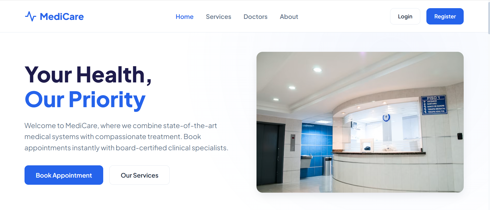
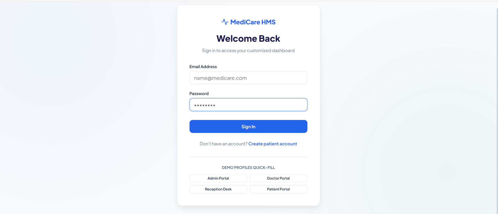
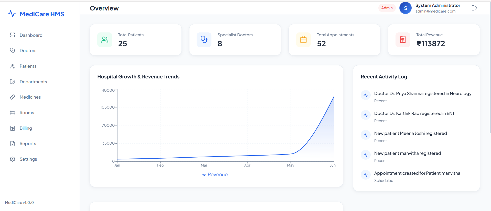
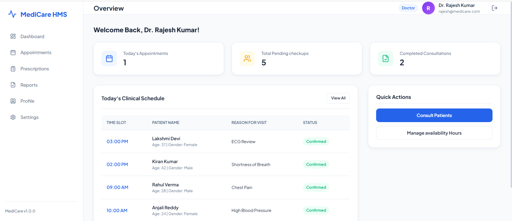
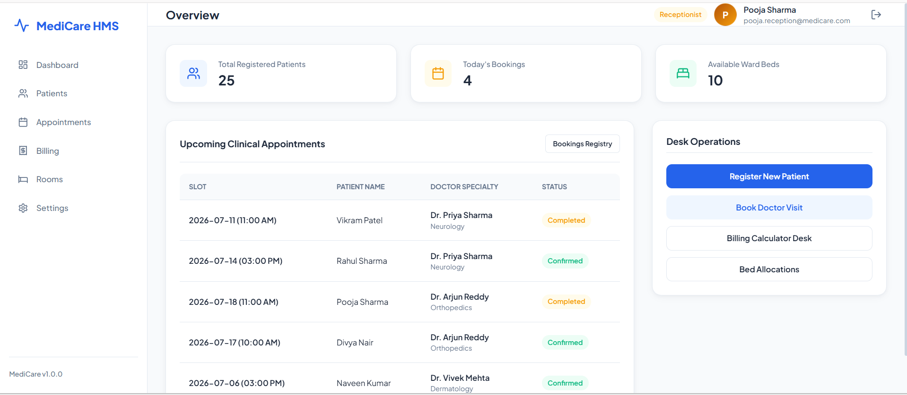
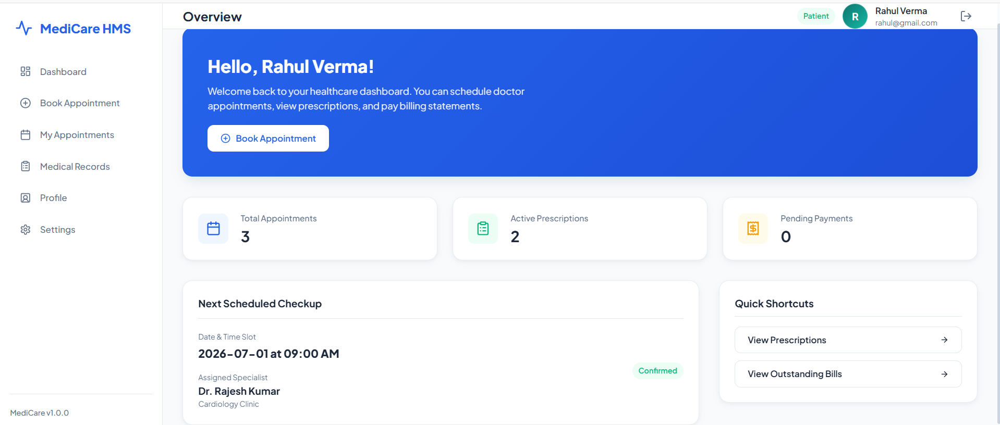
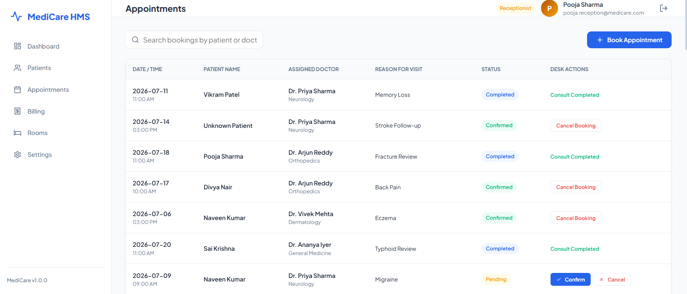
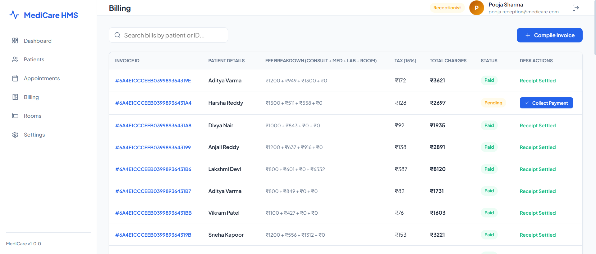

# 🏥 MediCare HMS - Hospital Management System

A comprehensive **Full Stack Hospital Management System (HMS)** built using the **MERN Stack** to streamline hospital operations through role-based portals for **Admin**, **Doctor**, **Receptionist**, and **Patient**. The system provides an intuitive interface for managing appointments, prescriptions, billing, medicines, laboratory reports, room allocation, and patient records.

---

# 🌐 Live Demo

### Frontend
https://medi-care-hospital-management-syste-topaz.vercel.app/

### Backend
https://dashboard.render.com/web/srv-d935um6gvqtc73a2rh80

---

# 📖 Overview

MediCare HMS digitizes everyday hospital operations by providing a centralized platform for administrators, doctors, receptionists, and patients. It eliminates manual record keeping while improving communication, appointment scheduling, inventory management, and patient care.

The project follows a modular architecture with a React frontend, Express REST API, MongoDB Atlas database, and JWT-based authentication.

---

# ✨ Features

## 👨‍💼 Admin Portal

- Secure Login
- Dashboard Analytics
- Doctor Management
- Patient Management
- Department Management
- Appointment Monitoring
- Medicine Inventory
- Room Management
- Billing Management
- Laboratory Report Management
- Hospital Statistics

---

## 👨‍⚕️ Doctor Portal

- Secure Login
- Dashboard
- View Scheduled Appointments
- Manage Prescriptions
- View Patient Medical History
- Review Laboratory Reports
- Update Professional Profile
- Configure Consultation Schedule

---

## 👩‍💼 Receptionist Portal

- Patient Registration
- Appointment Scheduling
- Room Allocation
- Billing Generation
- Payment Collection
- Patient Check-in

---

## 🧑 Patient Portal

- Register/Login
- Book Appointments
- View Appointment History
- Access Prescriptions
- Download Laboratory Reports
- View Bills
- Update Personal Profile

---

# 🏥 Hospital Modules

- Authentication
- Dashboard Analytics
- Doctors
- Patients
- Departments
- Medicines
- Rooms
- Appointments
- Prescriptions
- Bills
- Laboratory Reports

---

# 🔐 Authentication

Role-Based Authentication using **JWT**

Supported Roles

- Admin
- Doctor
- Receptionist
- Patient

Passwords are securely hashed using **bcryptjs**.

---

# 🛠 Tech Stack

## Frontend

- React.js
- Vite
- React Router DOM
- Context API
- Lucide React
- Recharts
- CSS3

---

## Backend

- Node.js
- Express.js
- REST APIs
- JWT Authentication
- bcryptjs
- dotenv
- CORS

---

## Database

- MongoDB Atlas
- Mongoose ODM

---

# 🏗 Project Architecture

```
                React + Vite Frontend
                        │
                 REST API (Express)
                        │
              JWT Authentication Layer
                        │
               MongoDB Atlas Database
```

---

# 📂 Folder Structure

```
MediCare-Hospital-Management-System

├── client
│
│   ├── public
│   ├── src
│   │
│   ├── components
│   ├── context
│   ├── layouts
│   ├── pages
│   │     ├── admin
│   │     ├── doctor
│   │     ├── patient
│   │     ├── receptionist
│   │     └── public
│   │
│   ├── services
│   ├── styles
│   └── App.jsx
│
├── server
│
│   ├── config
│   ├── controllers
│   ├── middleware
│   ├── models
│   ├── routes
│   ├── utils
│   ├── server.js
│   └── package.json
│
└── README.md
```

---

# 🗄 Database Collections

The project uses MongoDB Atlas with the following collections:

- Users
- Doctors
- Patients
- Departments
- Medicines
- Rooms
- Appointments
- Prescriptions
- Bills
- Reports

---

# 🚀 Installation

## Clone Repository

```bash
git clone https://github.com/manvitha40/MediCare-Hospital-Management-System.git

cd MediCare-Hospital-Management-System
```

---

## Backend Setup

```bash
cd server

npm install
```

Create a `.env` file

```env
PORT=5005

MONGODB_URI=your_mongodb_connection_string

JWT_SECRET=your_secret_key

USE_MOCK_DB=false
```

Run Backend

```bash
npm start
```

---

## Frontend Setup

```bash
cd client

npm install
```

Create `.env`

```env
VITE_API_URL=http://localhost:5005
```

Run Frontend

```bash
npm run dev
```

---

# 🏥 Initialize Hospital Database

After deploying or starting the backend, initialize the hospital database using:

```
GET /api/init
```

This automatically populates the database with realistic dummy hospital data including:

- Admin
- Doctors
- Receptionist
- Patients
- Departments
- Medicines
- Rooms
- Appointments
- Prescriptions
- Bills
- Reports

---

# 🔑 Demo Credentials

| Role | Email | Password |
|------|-------|----------|
| Admin | admin@medicare.com | admin123 |
| Doctor | rajesh@medicare.com | doctor123 |
| Receptionist | pooja.reception@medicare.com | reception123 |
| Patient | rahul@gmail.com | patient123 |


---

# 📡 REST API

## Authentication

```
POST   /api/auth/register
POST   /api/auth/login
GET    /api/auth/me
PUT    /api/auth/profile
```

---

## Doctors

```
GET    /api/doctors
POST   /api/doctors
PUT    /api/doctors/:id
DELETE /api/doctors/:id
```

---

## Patients

```
GET    /api/patients
POST   /api/patients
PUT    /api/patients/:id
DELETE /api/patients/:id
```

---

## Departments

```
GET    /api/departments
POST   /api/departments
DELETE /api/departments/:name
```

---

## Appointments

```
GET    /api/appointments
POST   /api/appointments
PUT    /api/appointments/:id
```

---

## Prescriptions

```
GET    /api/prescriptions
POST   /api/prescriptions
```

---

## Medicines

```
GET    /api/medicines
POST   /api/medicines
PUT    /api/medicines/:id
DELETE /api/medicines/:id
```

---

## Rooms

```
GET    /api/rooms
PUT    /api/rooms/:roomNumber
```

---

## Bills

```
GET    /api/bills
POST   /api/bills
PUT    /api/bills/:id/pay
```

---

## Reports

```
GET    /api/reports
POST   /api/reports
```

---

# 🧪 Clinical Workflow

1. Patient registers or logs in.
2. Patient books an appointment.
3. Receptionist schedules the appointment.
4. Doctor reviews the patient and generates a prescription.
5. Laboratory reports are uploaded.
6. Billing is generated.
7. Patient views prescriptions, reports, and bills from their portal.

---

# 📸 Application Screenshots

## Landing Page



---

## Login Page



---

## Admin Dashboard



---

## Doctor Dashboard



---

## Receptionist Dashboard



---

## Patient Dashboard



---

## Appointments Module



---

## Billing Module



# 🚀 Future Enhancements

- Email Notifications
- SMS Appointment Reminders
- Online Payment Gateway
- Medical Document Uploads
- Doctor Availability Calendar
- Video Consultation
- AI-based Disease Prediction
- OCR Prescription Scanner
- Multi-Hospital Support
- Advanced Analytics Dashboard

---

# 👨‍💻 Developer

**Sai Manvitha Pamulapati**

B.Tech Computer Science and Engineering

SRM University-AP

GitHub: https://github.com/manvitha40

LinkedIn: www.linkedin.com/in/pamulapati-sai-manvitha-125429291

---

# ⭐ Support

If you found this project helpful, consider giving it a **⭐ Star** on GitHub!
